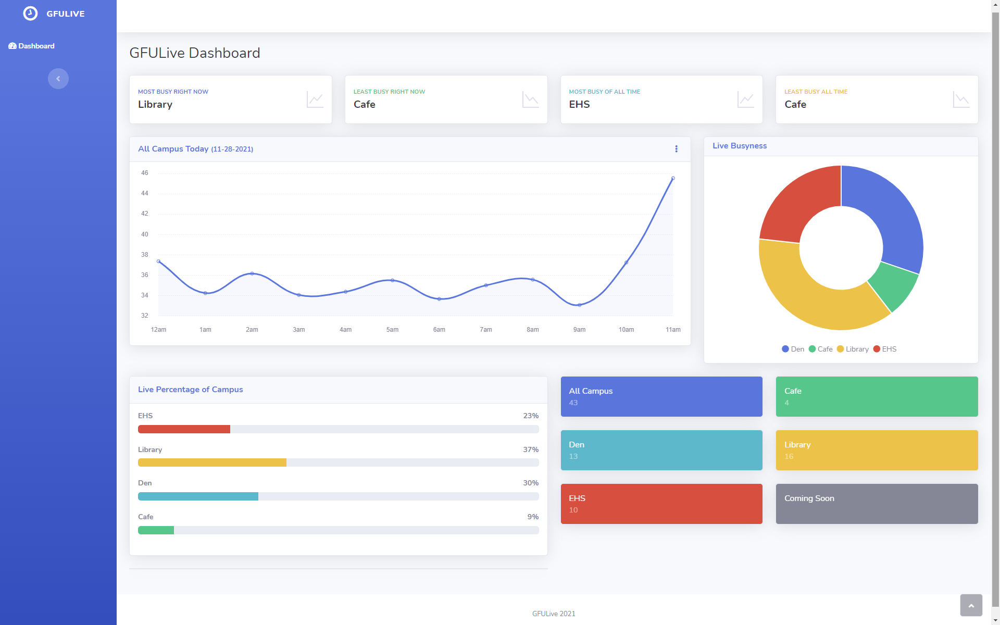
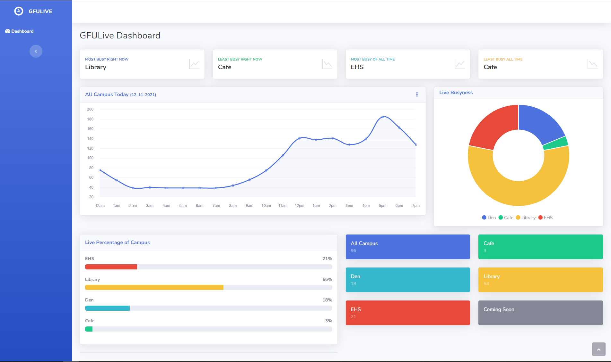

# GFU Live

This project is based off the desire to know how busy study areas are around a college campus. The goal of the project was to create a user friendly website to show accurate readings of how many bluetooth devices are currently in a general area or building. This would present the user with knowledge of how busy a building was without having to be there.

This ‘busyness monitor’ kept the front-end server up to date and displayed how many bluetooth devices were located in the general area. The user could then access the UI and see raw numbers, statistics and busyness compared to other buildings.

The raspberry pi zero’s bluetooth scanning functionally makes this possible by scanning for bluetooth devices which and logging their counts in a database with an offset to present accurate readings.

 

## Server Side

Code located in `/server`

Frontend in `/server/public`

Dashboard built using Bootstrap Studio.

The backend was built using PHP running on an Apache server with a PostgreSQL database running locally.

 

### Setup

To get this running, update the function titled `connect_to_db` in `public/api/lib.php` with your PostgreSQL credentials.

To setup your database, run `createTables.sql` to generate your tables, followed by `loadDB.sql` to set default values.

Run `time.sql` and `yesterday.sql` to create the views which are used to display recent results to the dashboard.

 

### API Endpoints:

All API endpoints are located in `server/public/api`

NOTE: All the API endpoints are public and do not require authentication. If you plan on using this project in any public setting please implement basic authentication so your endpoints aren't vulnerable to the internet.

POSTing is only designed to be done from the Pi's.

#### Counts:

* GET `api/counts`
    * PARAMETERS: `pi_id: {ID}`
    * RETURNS: All the counts record for the given Pi, or all the counts for every PI if no ID is specified.

* POST  `api/counts`
    *  PARAMETERS: `source_pi_id: {ID}` ,  `device_count: {INT}`
    *  RETURNS: Nothing if successful, or an error if something went wrong.

#### IP Addresses:

* GET `api/ip`
  * PARAMETERS: `id: {ID}`
  * RETURNS: The IP addresses for the Pi requested, or all Pi ID's with their IP addresses if no ID is specified.

* POST `api/ip`
  * PARAMETERS: `source_pi_id: {ID}` , `IP: {IP ADDRESS}`
  * RETURNS: Nothing is successful, or an error if something went wrong.

#### PI Locations:

* GET `api/pi` Returns each Pi's ID with its physical location
   * PARAMETERS: `id: {ID}`
   * RETURNS: The location for the specified Pi, or each Pi's ID with location if none is specified.

 

## Pi Side

All the code that runs in the Raspberry Pi's is stored in `/pi`

### Setup

Update `scanner.py` and `updateIP.py` with your domain.

Run `scan.sh` to begin the scanning. Every 5 minutes it will call `scanner.py` to send the results to the API. It will also run `updateIP.py` with every POST to the API to ensure the IP addresses in the database are consistent.

Our original project autostarted `scan.sh` from `.bashrc`, but you may use any tool you prefer to autostart the script.

 

### Dependencies
* Python3
* bluetoothctl
* requests

Install using `/pi/dependencies.sh`

 

## Dashboard Demo

Early in the morning:

Towards the end of the day:
